# 机器学习基石（上）

## Week 1 The Learning Problem

### 1. What is Machine Learning ？

observations --> learning --> skills

data --> ML --> skills

技巧 Skills： 表现增进 improve some performance measure

应用场景：

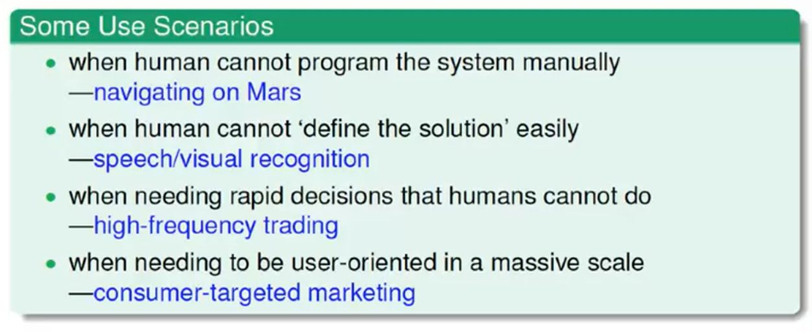

ML使用关键条件：

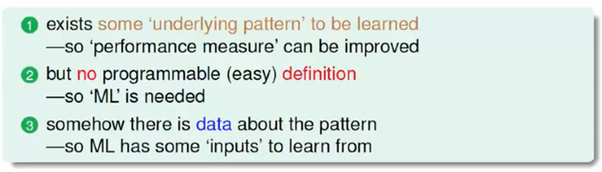

### 2. Applications of Machine Learning

All the regions!

方方面面都可以使用！

### 3. Components of Machine Learning

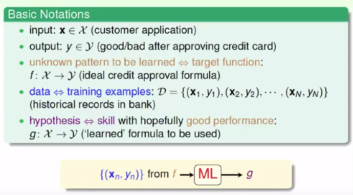

### 4. Machine Learning and Other Fields

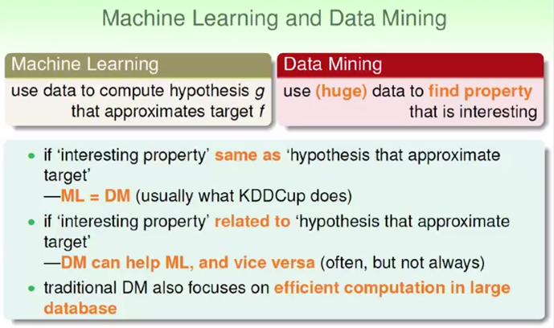

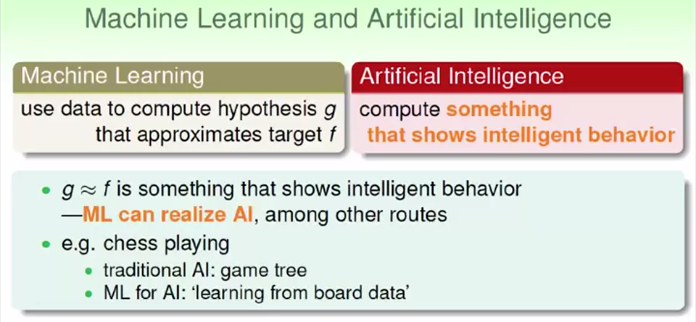

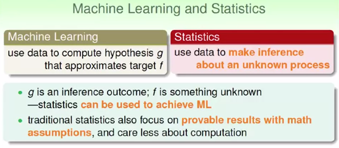

## Week 2 Learning to Answer Yes/No

### 1. Perceptron Hypothesis Set

感知机公式：$f(x) = sign(w\cdot x + b)$

是一个线性分类器

### 2. Perceptron Learning Algorithm

$$
Loss = -\sum_{x_i} y_i(w \cdot x_i + b)\notag
$$

对w和b求偏导，利用随机梯度下降法，随机选取误分类点$(x_i,y_i)$进行更新
$$
w = w + \eta y_ix_i \\
b = b + \eta y_i \notag
$$

### 3. Guarantee of PLA

感知机只适用于线性可分的情况，只有数据线性可分时，PLA才能停止。

Novikoff定理

1）设训练集线性可分，则存在满足$||w_{opt}|| = 1$的超平面$w_{opt}\cdot x = 0$，能将训练数据完全正确分开

2）假设训练集中最大的L-2范数为$R = max||x_i||$，最小分类间隔为$\gamma > 0$，$y_i(w_{opt}\cdot x_i) \geq \gamma$，则感知机算法的误分类次数满足不等式
$$
k \leq (\frac{R}{\gamma})^2 \notag
$$

### 4. Non-Separable Data

pros: 简单实施，适用于多维

cons: 需要线性可分的先验，收敛次数不确定

Line with Noise Tolerance:
$$
\mathbf{w}_{g} \leftarrow \underset{\mathbf{w}}{\operatorname{argmin}} \sum_{n=1}^{N}\left[y_{n} \neq \operatorname{sign}\left(\mathbf{w}^{T} \mathbf{x}_{n}\right)\right] \notag
$$
这是一个NP-hard问题。

一种基于贪心的方法（PLA的一种衍生方法，pocket算法）：

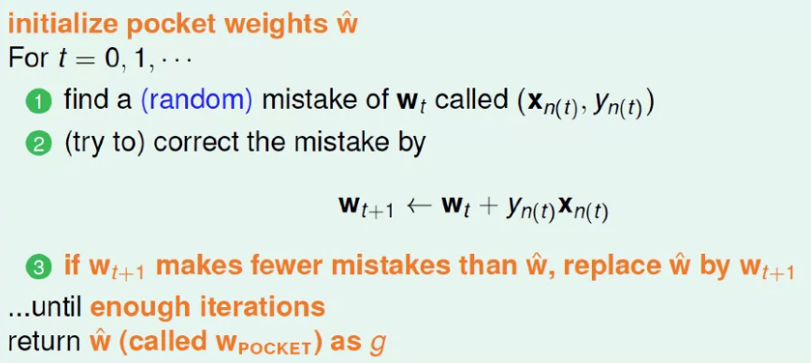

当数据集线性可分时，Pocket算法和PLA算法比较：

Pocket算法会慢一点，因为每一次迭代，都需要遍历$x_i$，进行计算比较；但最终结果相同。

## Week 3 Types of Learning

### 1. Learning with Different Output Space

**输出空间不一样：**

是非题，binary classification，二元分类任务

Multiclass classification 多分类问题

回归分析 Regression

结构学习 Structured Learning

### 2. Learning with Different Data Label

**输出标记不一样：**

|   监督/supervised   | 非监督/unsupervised |
| :-----------------: | :-----------------: |
| 分类/classification |   聚类/clustering   |

半监督学习

增强学习

### 3. Learning with Different Protocol

| **Batch**  |         all known data          |
| :--------: | :-----------------------------: |
| **Online** |  **sequential(passive) data**   |
| **Active** | **strategically-observed data** |

主动学习 Active，机器主动问问题

### 4. Learning with Different Input Space

Concrete Features

Abstract Features

## Week 4 Feasibilty of Learning

### 1. Learning is Impossible?

No free lunch!

资料之外的结论是学习不到的。

### 2. Probability to the Rescue

Hoeffding不等式

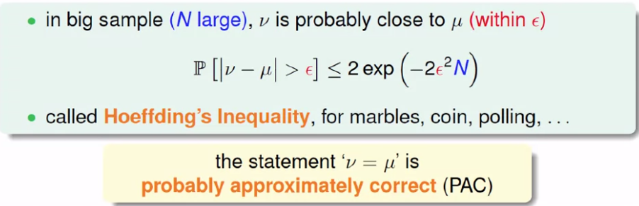

这个概率（坏事发生的概率）跟$\mu$无关，即没有对实际数据的要求。

### 3. Connection to Learning

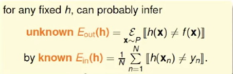

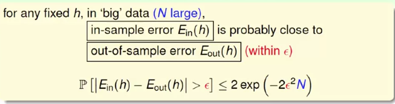

应用Hoeffding不等式

由此，不需要知道$f$和$P$。

只能做Verification，不能做$g$的选择，只能判断$g$的好坏。

### 4. Connection to Real learning

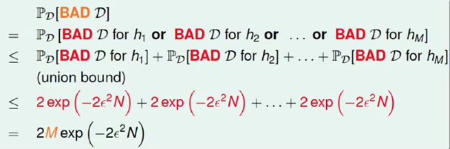

如果，假设空间有限，N无限个，即可学习。

## Week 5 Training versus Testing

### 1. Recap and Preview

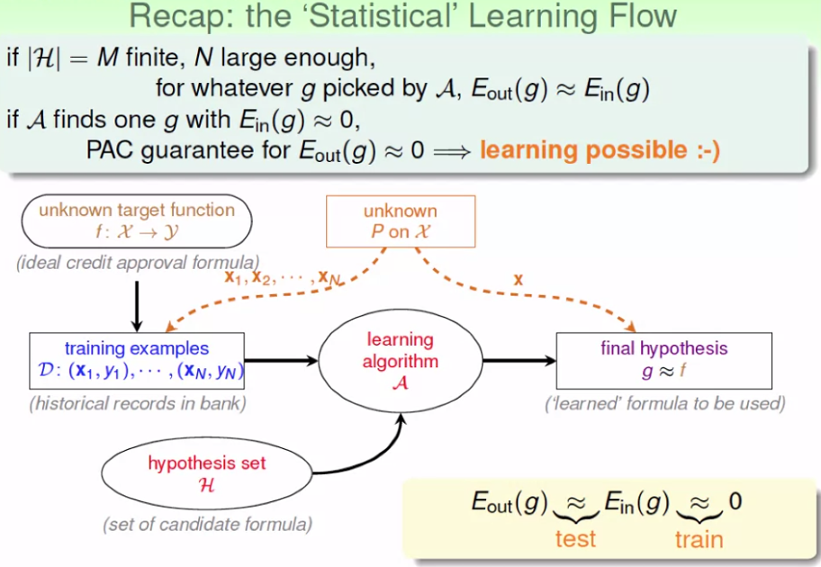

课程总结

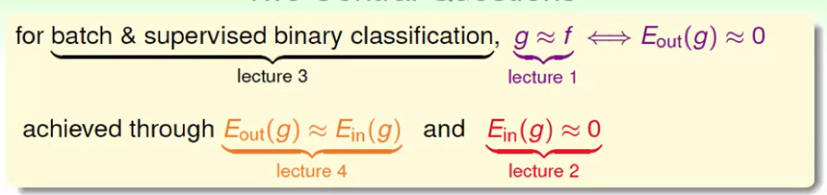

$g$为要学习的函数，$f$为数据的分布于函数，$E$为损失函数(惩罚函数)

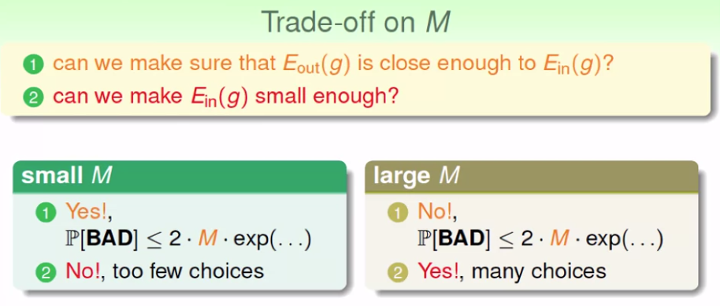

$M$是假设空间集合($H$)的大小，即可以有多少choices

### 2. Effective Number of Lines

在2D空间上，N个点的lines必定小于2^N种情况

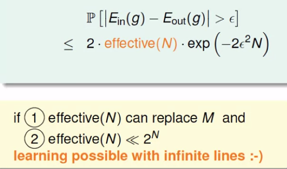

将M替换成effecitve(N)

### 3. Effective Number of Hypotheses

$m_H(N)$为成长函数，the growth function

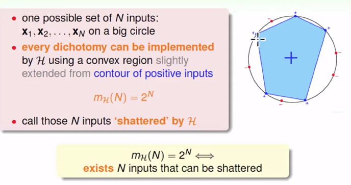

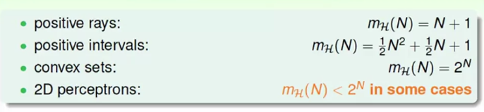

### 4. Break Point

Break Point的定义：

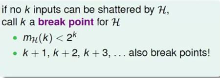

比如感知机里，$k$=4时，无法有16种假设空间解

其他例子中：

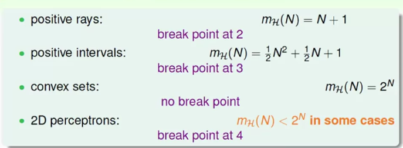

## Week 6 Theory of Generalization

### 1.  Restriciton of Break Point

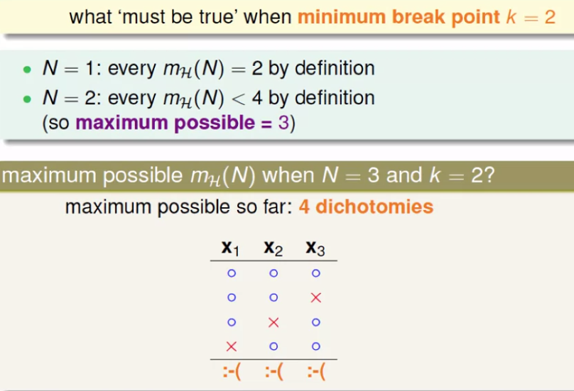

Break Point 为2，意思为不能存在2个元素的全组合（只能有3种排列组合）

$N = 3$， maximum possible = 4

### 2. Bounding Function: Basic Cases

$B(N,k)$，N为N个points，k为Break Point，成长函数的上限

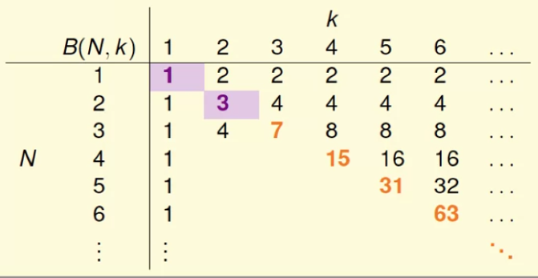

右上部分：$N < k$时，$B(N,k)$必然可以取$2^N$种

斜对角线：$N = k$时，$B(N,k)$最多取$2^N - 1$种

### 3.  Bounding Function: Inductive Cases

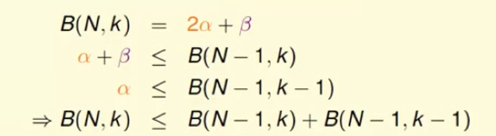

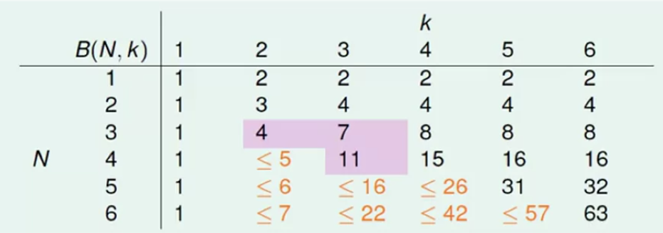

由此得到了$B(N,k)$的上限，得到了成长函数的上限的上限。

而$B(N,k)$的上限是多项式函数，因此成长函数的上限的上限也为一个多项式函数，也即成长函数的上限为多项式函数。

### 4. A Pictorial Proof

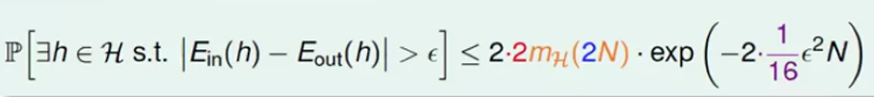

## Week 7 The VC Dimension

### 1. Definition of VC Dimension

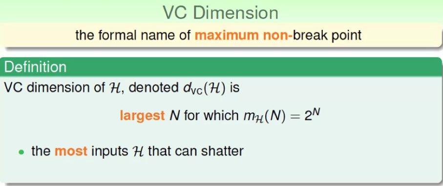

VC维 = 最小的Break Point - 1， 即最大的不是Break Point 的点

### 2. VC Dimension of Perceptrons

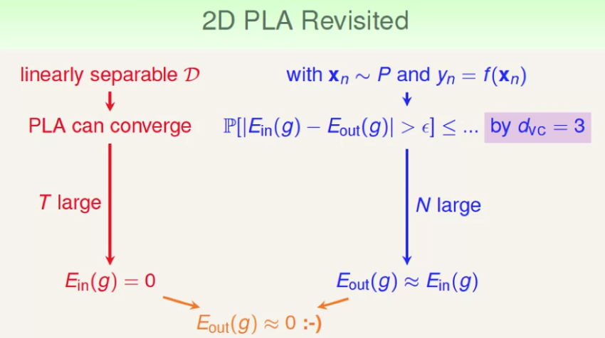

可以证明对于D维的Perceptrons

其VC-Dimension为D + 1。

### 3. Physical Intuition of VC Dimension

VC维：一个假设集有多少个Parmameters，一个假设集的自由度

一个d维Perceptrons的VC维度应该是$d + 1$，直观理解成$d + 1$个自由度，现在题目要求$w_0$被限制了，也就是自由度被限制了，因此，对于本题，此时VC维为d。

### 4. Interpreting VC Dimension

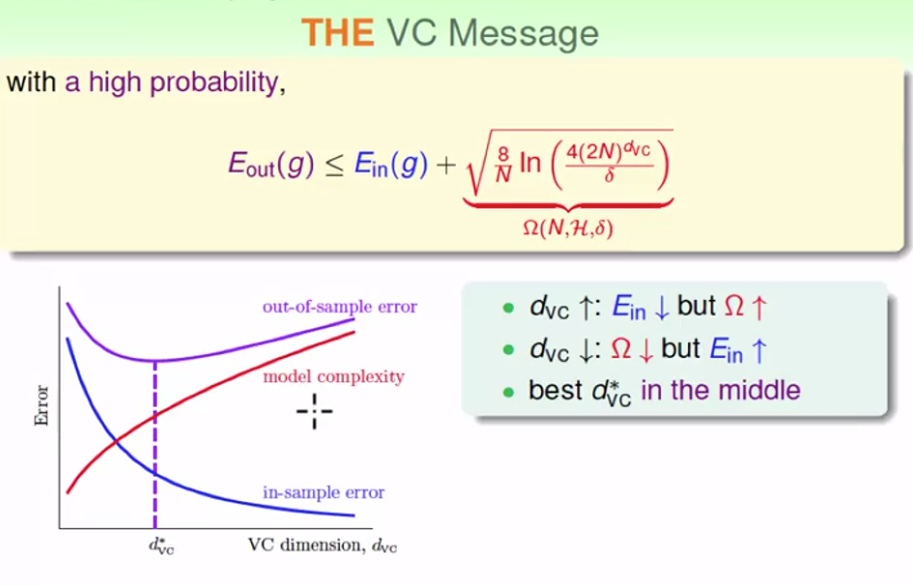

## Week 8 Noise and error

### 1. Noise and Probabilistic Target

### 2. Error Measure

0-1错误函数：分类问题

平方错误函数：回归问题

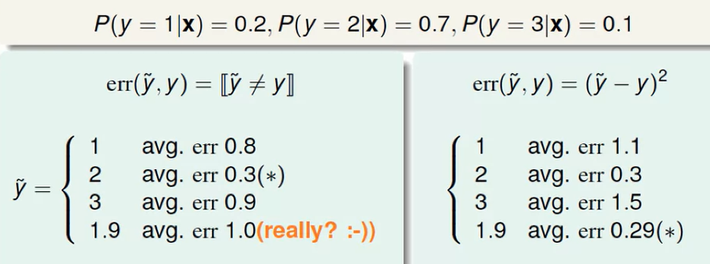

### 3. Algorithm Error Measure

Precision

Recall

### 4. Weighted Classification

带权重的分类错误函数